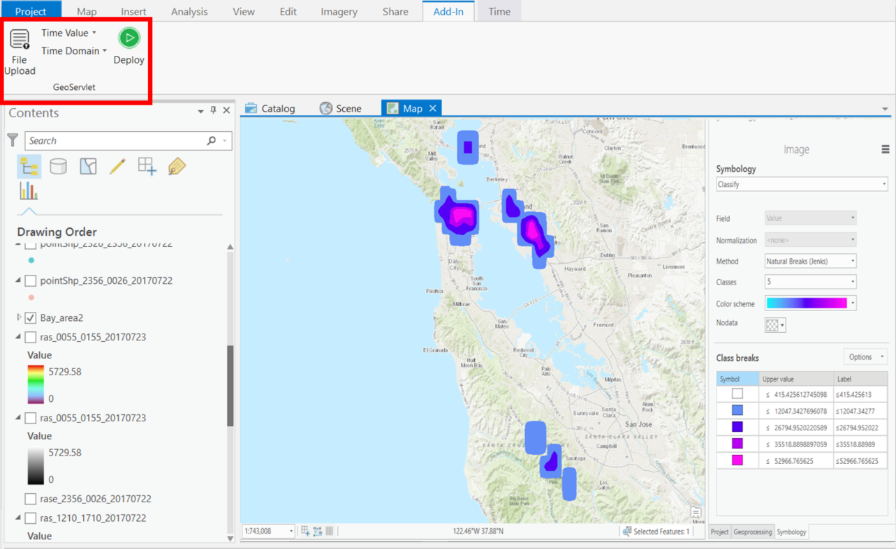
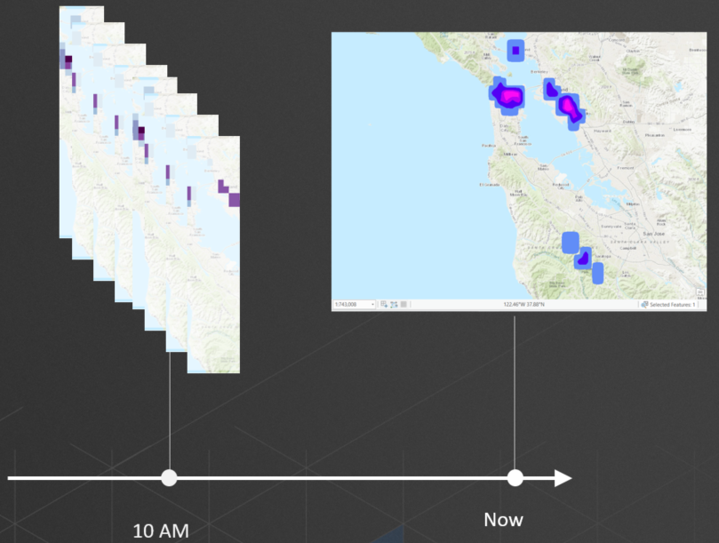
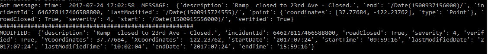

# GeoServlet
An ArcGIS Pro Add-in (Visual C#) created during a two-day hackathon (Summer 2017).

## Problem statement
The geographical principal indicates that when two things are physically closer together, they have a stronger relationship. Now, with the whole big data/ Internet of Things, things are also connected by time. 

We built an add-in to ArcPro that will enable stronger analytical power with real-time data by allowing you to analyze chunks of recent data.

It enables a data analyst to aggregate temporal data over multiple slices of time and be able to represent it on a 2-dimensional map.

## Use case
To demonstrate this idea, we located a real-time streaming source for San Fransisco Traffic and we used it to map not only spatial data (number of incidents), but also temporal data (the duration of incidents before they clear out)

This would allow an urban planner to effectively measure whether a particular change in protocol actually reduced the duration of incidents. 

## Scripting
We had one script running continuously to stream and save traffic data:

We stored the data in csv files. Then we wrote a script to parse out the data and generate raster files from them (main.py).
It is very clunky, uncommented, and disorganized, but it worked for a proof of concept.

We built a utility add-in for ArcGIS Pro that would allow a user to schedule this script to run at a particular frequency in order to enable this idea of passive analysis.
 
